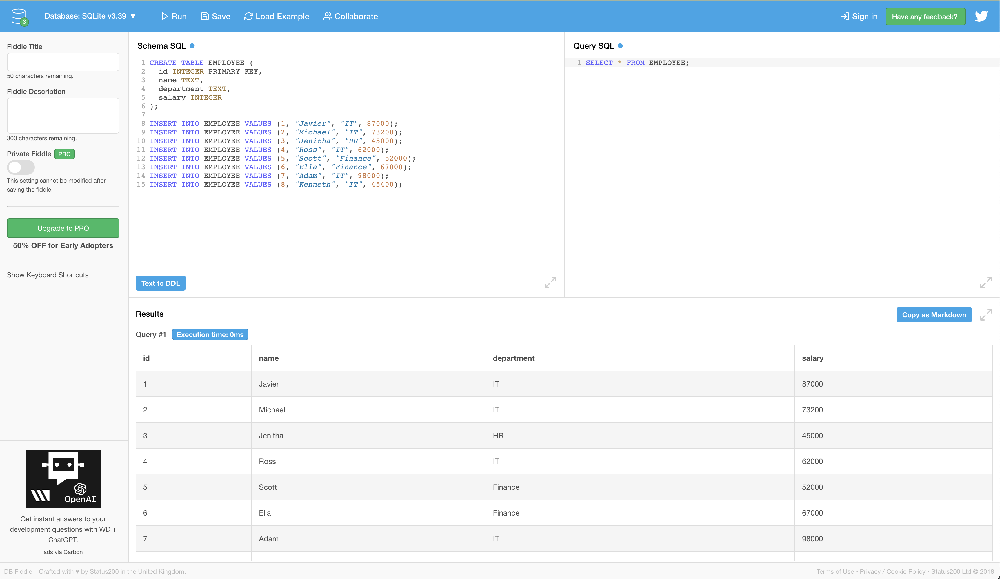

# Introduction to Window Functions

## Introduction
We'll be going over how to apply window functions in SQL to solve complex problems. Window functions help users to perform calculations against partitions over some window. Unlike traditional aggregation functions that outputs a single value for the entire operation, window functions return a signle value for each interval.

## Objectives
- Introduce various aggregate functions, like `SUM()`, `MIN()`, `MAX()
- Introduce various window functions, like `PARTITION BY()`

### What are window functions?

[This]([https://www.postgresql.org/docs/9.1/tutorial-window.html]) definition from PostgreSQL does a great job on defining what ~window functions~ are. 

_A window function performs a calculation across a set of table rows that are somehow related to the current row. This is comparable to the type of calculation that can be done with an aggregate function. But unlike regular aggregate functions, use of a window function does not cause rows to become grouped into a single output row — the rows retain their separate identities. Behind the scenes, the window function is able to access more than just the current row of the query result._

A general syntax for a window function looks like below:
```
SELECT coulmn_name1, 
 window_function(cloumn_name2)
 OVER([PARTITION BY column_name1] [ORDER BY column_name3]) AS new_column
FROM table_name;
```

Window functions applies aggregate or ranking functions over a particular _window_ (set of rows). _OVER_ clause is used with window functions to define those set of rows. _OVER_ does two things:
- Partitions rows into define set of rows (_PARTITION BY_)
- Orders rows in a particular order (_ORDER BY_)


### Aggregate Window Functions
There are various aggregate functions such as `SUM()`, `COUNT()`, `AVERAGE()`, `MAX()`, and `MIN()` that can be applied over a particular window. These do not need to have _OVER_ clause and can be used independently. For example,
```
SELECT COUNT(*) FROM table_name;
```
will return the total number of rows of that `table_name`. `SUM()`, `AVERAGE()`, `MAX()`, and `MIN()` can be applied over integer or float columns. 

Let's get comfortable with these functions before applying _OVER_ clause for window functions.

Navigate to [db-fiddle]([https://www.db-fiddle.com/]) and select SQLite at the top left corner, then paste below DDL in the left panel.

```
CREATE TABLE EMPLOYEE (
  id INTEGER PRIMARY KEY,
  name TEXT,
  department TEXT,
  salary INTEGER
);

INSERT INTO EMPLOYEE VALUES (1, "Javier", "IT", 87000);
INSERT INTO EMPLOYEE VALUES (2, "Michael", "IT", 73200);
INSERT INTO EMPLOYEE VALUES (3, "Jenitha", "HR", 45000);
INSERT INTO EMPLOYEE VALUES (4, "Ross", "IT", 62000);
INSERT INTO EMPLOYEE VALUES (5, "Scott", "Finance", 52000);
INSERT INTO EMPLOYEE VALUES (6, "Ella", "Finance", 67000);
INSERT INTO EMPLOYEE VALUES (7, "Adam", "IT", 98000);
INSERT INTO EMPLOYEE VALUES (8, "Kenneth", "IT", 45400);
```
Then execute 
```
SELECT * FROM EMPLOYEE;
```
You should see something like below:


Let's try this exercise. How can we get the average salary by each department? We can execute query below;
```
SELECT department, AVG(salary) from EMPLOYEE group by department;
```

Now, let's try the query below:
```
SELECT department, name, salary, avg(salary) OVER (PARTITION BY department) FROM EMPLOYEE;
```
What is the difference between two queries? 

The first query cannot expose all the information in the table because it's simply applying `group by` operation. Using `OVER` and `PARTITION BY` clauses, you are able to split up the rows, partitioned by department, and then apply `AVG()` function within that partition.

### Summary

In this example, we went over a very simple example to really see the difference between the `AVG()` function usage without _OVER_ clause. In the next lesson, we'll do a deeper dive into other window functions with the same dataset. 
